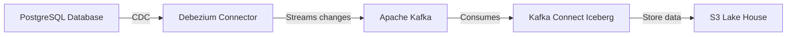
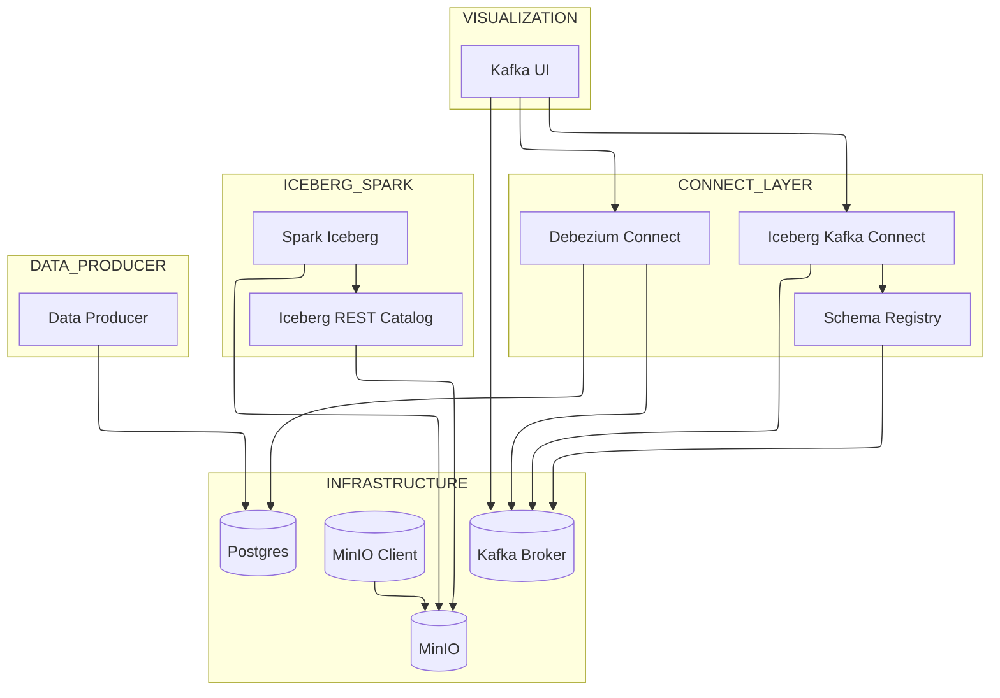
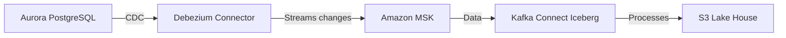

# Solution Architecture

## Overview
The solution implements a real-time data streaming pipeline using Debezium for Change Data Capture (CDC) from PostgreSQL to Apache Kafka (using Kafka Connect Source), then uses Apache Iceberg Kafka Connect Sink (using Kafka Connect) for storing the data on Iceberg format on the Lake House.

### Docker-Compose ( local mode)

### Services Communication

## Components

### Local Development Environment (Docker Compose)
1. **PostgreSQL Database**
   - Source database where data changes are captured
   - Runs in a Docker container
   - Configured with logical replication for CDC

2. **Apache Kafka & Zookeeper**
   - Message broker for streaming data
   - Managed by Docker Compose
   - Stores change events from Debezium

3. **Debezium Connect**
   - CDC connector running in Docker
   - Monitors PostgreSQL WAL logs
   - Streams changes to Kafka topics

4. **Python Data Producer**
   - Generates sample data
   - Inserts records into PostgreSQL
   - Runs as a separate container

### AWS Cloud Environment (CloudFormation)

### AWS architecture

1. **Amazon Aurora PostgreSQL**
   - Managed PostgreSQL database
   - Configured with logical replication
   - Source for CDC operations

2. **Amazon MSK (Managed Streaming for Kafka)**
   - Fully managed Kafka service
   - Handles streaming data from Debezium
   - Configured with optimal instance types

3. **MSK Connect with Debezium**
   - Managed Debezium connector service
   - Integrates with Aurora PostgreSQL
   - Streams changes to MSK topics

4. **AWS Glue Job**
   - Python shell job for data processing
   - Code stored in S3 bucket
   - Processes data from MSK topics

5. **S3 Bucket**
   - Stores Python code for Glue job
   - Acts as a data lake for processed data
   - Provides durable storage

