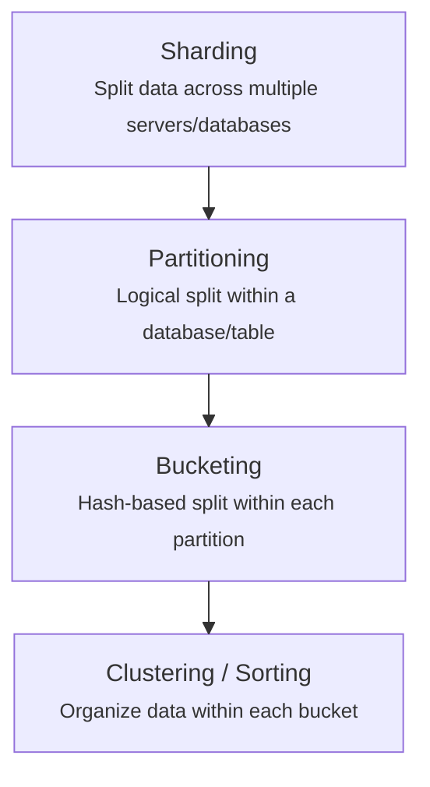

### Hierrachy 

```mermaid
---
config:
  layout: elk
---
flowchart TD
    A["Sharding<br><small>Split data across multiple servers/databases</small>"] --> B["Partitioning<br><small>Logical split within a database/table</small>"]
    B --> C["Bucketing<br><small>Hash-based split within each partition</small>"]
    C --> D["Clustering / Sorting<br><small>Organize data within each bucket</small>"]

```