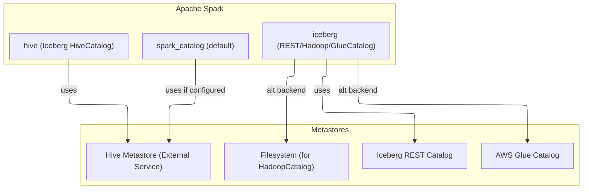

### Catalog flow

```mermaid
---
config:
  layout: elk
---
flowchart TD
 subgraph Spark["Apache Spark"]
        A["spark_catalog (default)"]
        B["hive (Iceberg HiveCatalog)"]
        C["iceberg (REST/Hadoop/GlueCatalog)"]
  end
 subgraph Metastores["Metastores"]
        HMS["Hive Metastore (External Service)"]
        REST["Iceberg REST Catalog"]
        FS["Filesystem (for HadoopCatalog)"]
        GLUE["AWS Glue Catalog"]
  end
    A -- uses if configured --> HMS
    B -- uses --> HMS
    C -- uses --> REST
    C -- alt backend --> FS & GLUE

```