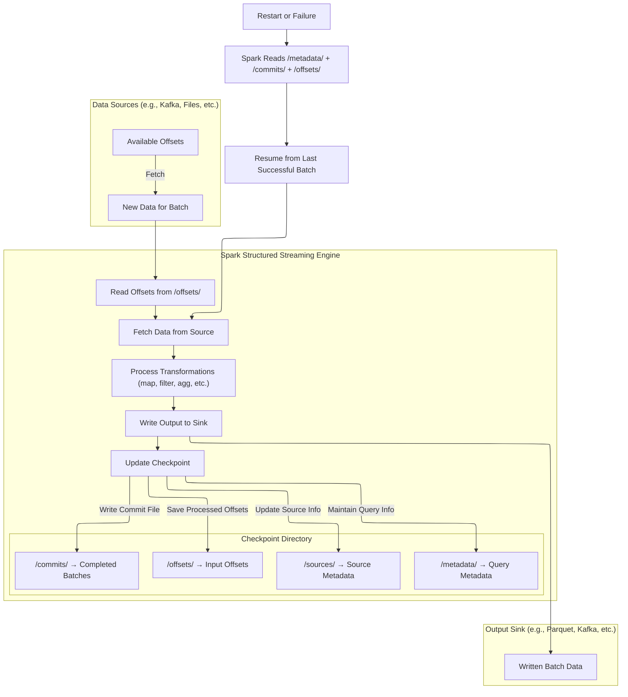

### Spark checkpoint flow

```mermaid
---
config:
  layout: elk
---
flowchart TD
 subgraph Source["Data Sources (e.g., Kafka, Files, etc.)"]
        A2["New Data for Batch"]
        A1["Available Offsets"]
  end
 subgraph Checkpoint["Checkpoint Directory"]
        C1["/offsets/ → Input Offsets"]
        C2["/sources/ → Source Metadata"]
        C3["/commits/ → Completed Batches"]
        C4["/metadata/ → Query Metadata"]
  end
 subgraph Spark["Spark Structured Streaming Engine"]
        B2["Fetch Data from Source"]
        B1["Read Offsets from /offsets/"]
        B3["Process Transformations (map, filter, agg, etc.)"]
        B4["Write Output to Sink"]
        B5["Update Checkpoint"]
        Checkpoint
  end
 subgraph Sink["Output Sink (e.g., Parquet, Kafka, etc.)"]
        D1["Written Batch Data"]
  end
    A1 -- Fetch --> A2
    B1 --> B2
    B2 --> B3
    B3 --> B4
    B4 --> B5 & D1
    B5 -- Write Commit File --> C3
    B5 -- Save Processed Offsets --> C1
    B5 -- Update Source Info --> C2
    B5 -- Maintain Query Info --> C4
    A2 --> B1
    E1["Restart or Failure"] --> E2["Spark Reads /metadata/ + /commits/ + /offsets/"]
    E2 --> E3["Resume from Last Successful Batch"]
    E3 --> B2

```